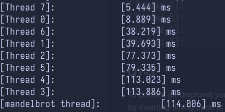

# Program 1: Parallel Fractal Generation Using Threads (20 points)

Build and run the code in the `prog1_mandelbrot_threads/` directory of
the code base. (Type `make` to build, and `./mandelbrot` to run it.)
This program produces the image file `mandelbrot-serial.ppm`, which is a visualization of a famous set of
complex numbers called the Mandelbrot set. Most platforms have a .ppm
view. To view the resulting images remotely, first make sure that you have _X server_. No downloads are needed
for Linux systems. However, for Mac you can use [Xquartz](https://www.xquartz.org/) and 
for Windows you can use [VcXsrv](https://sourceforge.net/projects/vcxsrv/).
After you have SSH X-Forwarding support, make sure you `ssh -Y` onto a myth machine and
you can then view the images using the `display` command. As you can see in the images below, the
result is a familiar and beautiful fractal.  Each pixel in the image
corresponds to a value in the complex plane, and the brightness of
each pixel is proportional to the computational cost of determining
whether the value is contained in the Mandelbrot set. To get image 2,
use the command option `--view 2`.  (See function `mandelbrotSerial()`
defined in `mandelbrotSerial.cpp`). You can learn more about the
definition of the Mandelbrot set at
<http://en.wikipedia.org/wiki/Mandelbrot_set>.

Your job is to parallelize the computation of the images using 
[std::thread](https://en.cppreference.com/w/cpp/thread/thread). Starter
code that spawns one additional thread is provided in the function
`mandelbrotThread()` located in `mandelbrotThread.cpp`. In this function, the
main application thread creates another additional thread using the constructor
`std::thread(function, args...)` It waits for this thread to complete by calling
`join` on the thread object.
Currently the launched thread does not do any computation and returns immediately.
You should add code to `workerThreadStart` function to accomplish this task.
You will not need to make use of any other std::thread API calls in this assignment.

### Q1-1

*Modify the starter code to parallelize the Mandelbrot generation using 
two processors. Specifically, compute the top half of the image in
thread 0, and the bottom half of the image in thread 1. This type
of problem decomposition is referred to as _spatial decomposition_ since
different spatial regions of the image are computed by different processors.*

This spatial decomposition approach is implemented in the `workerThreadStart`
function in `mandelbrotThread.cpp` file. It decomposes the image into row
blocks, each of which is assigned to one thread. The function implements logic
to handle cases where the height
of the image is not divisible by the number of threads

### Q1-2
*Extend your code to use 2, 3, 4, 5, 6, 7, and 8 threads, partitioning the image
generation work accordingly (threads should get blocks of the image). Note that
the processor only has four cores but each core supports two hyper-threads,
so it can execute a total of eight threads interleaved on its execution contents.
In your write-up, produce a graph of __speedup compared to the reference
sequential implementation__ as a function of the number of threads used
__FOR VIEW 1__. Is speedup linear in the number of threads used?
In your writeup hypothesize why this is (or is not) the case?
(you may also wish to produce a graph for VIEW 2 to help you come up with a
good answer. Hint: take a careful look at the three-thread datapoint.)*

The speedup gains diminish when using more than 2 threads. The snapshot
below illustrates the per-thread runtime breakdown for generating
__VIEW 1__ using 8 threads. Notably, thread 2 to 5 seem takes significantly
longer to complete, with thread 3 and 4 being the slowest. This explains
why increasing the thread count does not lead to a linear reduction in runtime.
For example, rows near the center of the image has larger workloads compared to
those near the top and bottom.

In contrast, the workload imbalance is less severe in VIEW 2, where the rows
near the top and bottom carry larger workloads while the remaining rows have
similar workloads. Consequently, the speedup gains also diminish as more
threads are added (but to a lesser extent).

### Q1-3
*To confirm (or disprove) your hypothesis, measure the amount of time
each thread requires to complete its work by inserting timing code at
the beginning and end of `workerThreadStart()`. How do your measurements
explain the speedup graph you previously created?*

Refer to the images above.

### Q1-4
Modify the mapping of work to threads to achieve to improve speedup to
at __about 7-8x on both views__ of the Mandelbrot set (if you're above 7x that's fine, don't sweat it). You may not use any
synchronization between threads in your solution. We are expecting you to come up with a single work decomposition policy that will work well for all thread counts---hard coding a solution specific to each configuration is not allowed! (Hint: There is a very simple static
assignment that will achieve this goal, and no communication/synchronization
among threads is necessary.). In your writeup, describe your approach to parallelization
and report the final 8-thread speedup obtained. 

### Q1-5
Now run your improved code with 16 threads. Is performance noticably greater
than when running with eight threads? Why or why not? 

