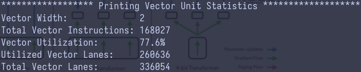
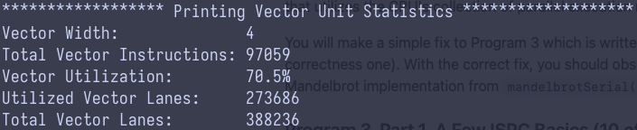
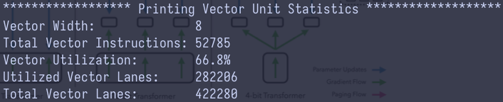
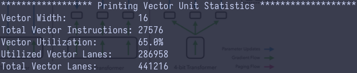
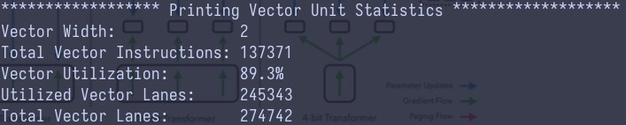
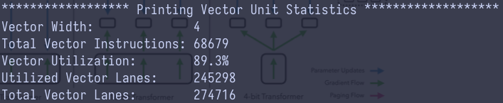
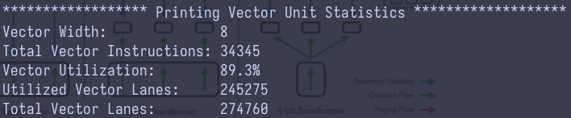
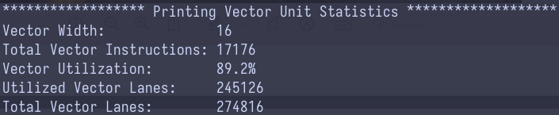

# Program 2: Vectorizing Code Using SIMD Intrinsics

Take a look at the function `clampedExpSerial` in `prog2_vecintrin/main.cpp` of the
Assignment 1 code base.  The `clampedExp()` function raises `values[i]` to the power given by `exponents[i]` for all elements of the input array and clamps the resulting values at 9.999999.  In program 2, your job is to vectorize this piece of code so it can be run on a machine with SIMD vector instructions.

However, rather than craft an implementation using SSE or AVX2 vector intrinsics that map to real SIMD vector instructions on modern CPUs, to make things a little easier, we're asking you to implement your version using CS149's "fake vector intrinsics" defined in `CS149intrin.h`.   The `CS149intrin.h` library provides you with a set of vector instructions that operate
on vector values and/or vector masks. (These functions don't translate to real CPU vector instructions, instead we simulate these operations for you in our library, and provide feedback that makes for easier debugging.)  As an example of using the CS149 intrinsics, a vectorized version of the `abs()` function is given in `main.cpp`. This example contains some basic vector loads and stores and manipulates mask registers.  Note that the `abs()` example is only a simple example, and in fact the code does not correctly handle all inputs! (We will let you figure out why!) You may wish to read through all the comments and function definitions in `CS149intrin.h` to know what operations are available to you. 

Here are few hints to help you in your implementation:

-  Every vector instruction is subject to an optional mask parameter.  The mask parameter defines which lanes whose output is "masked" for this operation. A 0 in the mask indicates a lane is masked, and so its value will not be overwritten by the results of the vector operation. If no mask is specified in the operation, no lanes are masked. (Note this equivalent to providing a mask of all ones.) 
   *Hint:* Your solution will need to use multiple mask registers and various mask operations provided in the library.
-  *Hint:* Use `_cs149_cntbits` function helpful in this problem.
-  Consider what might happen if the total number of loop iterations is not a multiple of SIMD vector width. We suggest you test 
your code with `./myexp -s 3`. *Hint:* You might find `_cs149_init_ones` helpful.
-  *Hint:* Use `./myexp -l` to print a log of executed vector instruction at the end. 
Use function `addUserLog()` to add customized debug information in log. Feel free to add additional 
`CS149Logger.printLog()` to help you debug.

The output of the program will tell you if your implementation generates correct output. If there
are incorrect results, the program will print the first one it finds and print out a table of
function inputs and outputs. Your function's output is after "output = ", which should match with 
the results after "gold = ". The program also prints out a list of statistics describing utilization of the CS149 fake vector
units. You should consider the performance of your implementation to be the value "Total Vector 
Instructions". (You can assume every CS149 fake vector instruction takes one cycle on the CS149 fake SIMD CPU.) "Vector Utilization" 
shows the percentage of vector lanes that are enabled. 

## Q2-1

*Implement a vectorized version of `clampedExpSerial` in `clampedExpVector` . Your implementation 
should work with any combination of input array size (`N`) and vector width (`VECTOR_WIDTH`).*

See `clampedExpVector` function in `main.cpp` file.

When the input array size is not a multiple of vector width, you cannot simply
initialize `maskAll` as:

```cpp
maskAll = _cs149_init_ones()
```

This approach incorrectly sets the mask lanes. For instance, consider the
case where
`N = 6` and `VECTOR_WIDTH = 4`. During the second iteration (`i=1`), 
only 2 valid values left in the input array, yet `maskAll` is still initialized
as a vector of 4 lanes. As a result, the two lanes without valid input
(which, in practice, will hold arbitrary values)
are incorrectly marked as active. The
example below illustrats this issue:

```text
input array: [1,2,3,4,5,6]
VECTOR_WIDTH: 4
i = 0:
    x = [1,2,3,4]
    maskAll = [1,1,1,1]
i = 1:
    x = [5,6,x,x]   # use x to represent some random values
    maskAll = [1,1,1,1] # correct should be [1,1,0,0]
```

To handle such cases properly, `maskAll` must be initialized with care.
The `_cs149_init_ones` intrinsic provides a solution by allowing a `first`
parameter. By default, the `first` parameter is set to
`VECTOR_WIDTH`.

```cpp
__cs149_mask _cs149_init_ones(int first = VECTOR_WIDTH);

__cs149_mask _cs149_init_ones(int first) {
  __cs149_mask mask;
  for (int i=0; i<VECTOR_WIDTH; i++) {
    mask.value[i] = (i<first) ? true : false;
  }
  return mask;
}
```

Continue with the example where `N=6` and `VECTOR_WIDTH=4`, the correct
value for the `first`  parameter during the second iteration should be `2`.
This sets the last two lanes in `maskAll` to inactive:

```text
i = 1:
    x = [5,6,x,x]
    x_index = [0,1,2,3]
    maskAll = [1,1,0,0]
```

A generalized solution is to set `first = N-i` for iterations where fewer
than VECTOR_WIDTH values remain. The following code snippet
illustrates the correct implementation:

```cpp
    int first = VECTOR_WIDTH;
    if (i + VECTOR_WIDTH > N) {
      first = N - i;
    }
```

This approach ensures that invalid lanes are correctly marked inactive,
preventing the use of arbitrary values during vectorized operations. And this
implementation can be found in [commit fe7ad7d](https://github.com/svm-zhang/parallel_compute/commit/fe7ad7d36d2b6a7daf3bbd5192178b817e0221f8).

However, correctly initializing `maskAll` does not guarantee correct results
when the input array size is smaller than the VECTOR_WIDTH--for example,
when `N = 3` and `VECTOR_WIDTH = 4`. Interestingly, the program 
takes a significantly long time (eventually getting killed) for such a small
input array when using
the implementation in
[commit fe7ad7d](https://github.com/svm-zhang/parallel_compute/commit/fe7ad7d36d2b6a7daf3bbd5192178b817e0221f8).
A similar issue occurs when `N=7` and `VECTOR_WIDTH=8`.

So what is exactly happens? Lets break down:

```text
input array: [1,2,3]
VECTOR_WIDTH: 4
i = 0:
    x = [1,2,3,x]
    maskAll = [1,1,1,0]     # note the last lane is inactive
    maskExpIsZero = [0, 0, 0, 0] # note the last lane is still zero
    maskExpNonZero = [1, 1, 1, 1] # problem is here
```

The issue occurs when setting the `maskExpNonZero`. Although the last lane
in `maskAll` is inactive, 
it becomes active in `maskExpNonZero` (indicated by the forth value being 1).
Consequently, the arbitrary value in `x` gets processed for its exponent
computation. If this arbitrary value happens to be 0, the program gets stuck
inside the `while` loop:

```cpp
    while (_cs149_cntbits(maskExpNonZero) > 0) {
      _cs149_vmult_float(result, result, x, maskExpNonZero);
      _cs149_vsub_int(count, count, one, maskExpNonZero);
      _cs149_veq_int(maskExpIsZero, count, zero, maskExpNonZero);
      maskExpNonZero = _cs149_mask_not(maskExpIsZero);
    }
```

Notice that on each iteration of the `while` loop, if any lane in the
exponent array (`count`) is not zero, the loop continues to execute.
When the arbitrary value happens to be 0 and its lane
is errorneously active in `maskExpNonZero`, the block inside the loop keeps
subtracting 1 from it; the value in that lane never become exactly 0, which
leads to an infinite loop (as indicated by the use of `_cs149_veq_int`
to check for equality with 0).

To fix this issue, I use a different intrinsic `_cs149_vgt_int`, which checks
whether
`count` is greater than zero and sets the corresponding mask lane accordingly.
This approach ensures that the mask lane is marked inactive when `count` 
is negative, and it also reduces one SIMD instruction. The updated loop is as
follows:

```cpp
    while (_cs149_cntbits(maskExpNonZero) > 0) {
      _cs149_vmult_float(result, result, x, maskExpNonZero);
      _cs149_vsub_int(count, count, one, maskExpNonZero);
      _cs149_vgt_int(maskExpNonZero, count, zero, maskExpNonZero);
    }
```

I also make sure the mask lane to be inactive before the `while` loop. The
`count` vector is initialized as `y-1` prior to the `while` loop:

```cpp
_cs149_vsub_int(count, y, one, maskExpNonZero);

```

If an arbitrary input is 1, its corresponding value in `count` would be set to
0 by the above subtraction. To prevent it, the same strategy of using
`_cs149_vgt_int` intrinsic is applied to verify that a value is greater than
zero rather than simply equal to zero.

You can find the final implementation in [commit 1361bd3](https://github.com/svm-zhang/parallel_compute/commit/1361bd3bec7ab5faa4c5b214b5d7f5e2f3b0353e).


## Q2-2

*Run `./myexp -s 10000` and sweep the vector width from 2, 4, 8, to 16. Record the resulting vector 
utilization. You can do this by changing the `#define VECTOR_WIDTH` value in `CS149intrin.h`. 
Does the vector utilization increase, decrease or stay the same as `VECTOR_WIDTH` changes? Why?*

The vector utilization decreases as the `VECTOR_WIDTH` increases, as illustrated
in the four images below.

`VECTOR_WIDTH=2`


`VECTOR_WIDTH=4`


`VECTOR_WIDTH=8`


`VECTOR_WIDTH=16`


This observation can be explained using an example with a skewed distribution of
the exponent array:

```text
exponets = [9, 1, 1, 1, 0, 0, 0, 10]

# VECTOR_WIDTH=4
i = 0:
    y = [9, 1, 1, 1]    # y is loaded from input exponent array 
i = 1:
    y = [0, 0, 0, 10]
```

Because one or couple of lanes have a large exponent, they remain active longer
while others lanes become inactive. This results in under-utilization of the
vector space.

If the distribution of exponent values is known beforehand, 
the utilization rate might be improved by reordering the exponent array--for
instance, by sorting it. Sorting readjusts the distribution so that the
exponents in each vector are more uniform.

```cpp
std::sort(exponents, exponents+N+VECTOR_WIDTH)
```

`VECTOR_WIDTH=2` after sorting


`VECTOR_WIDTH=4` after sorting


`VECTOR_WIDTH=8` after sorting


`VECTOR_WIDTH=16` after sorting


With this change, not only does the utilization rate remain stable as the
`VECTOR_WIDTH` increases, but it is also significantly improved across 
all values of `VECTOR_WIDTH`.

__I also noticed one interesting aspect:__ the total number of vector lanes processed
is significantly lower compared to the implementation without pre-sorting.
One possible explanation is that when sorting makes each vector more uniform.
As a result, the exponent values in each vector during a given iteration are
more likely to fall entirely into either
the `if` or the `else` branch, rather than splitting between the two.
This uniformity reduces the
overall count added to the total number of processed vector lanes. In fact, if
you examine
the total number of vector instructions executed, the pre-sorting implementation
incurs significantly fewer vector instructions, which further supports this explanation.

## Q2-3

*Implement a vectorized version of `arraySumSerial` in `arraySumVector`.
Your implementation may assume that `VECTOR_WIDTH` is a factor of the input array size `N`.
Whereas the serial implementation runs in `O(N)` time,
your implementation should aim for runtime of `(N / VECTOR_WIDTH + VECTOR_WIDTH)`
or even `(N / VECTOR_WIDTH + log2(VECTOR_WIDTH))`.
You may find the `hadd` and `interleave` operations useful.*

IMO, the primary point of this question comes down to how to implement 
`reduce sum`. The `hadd` and `interleave` intrinsics provided enable a runtime
of O(N/VECTOR_WIDTH + log2(VECTOR_WIDTH)) (the second term corresponds to the
`reduce sum`). I cannot think of an implementation of `reduce sum` that runs in
linear time using the given set of intrinsics. A naive approach, such as the
one below, defeats the purpose of using vectorized intrinsics:

```cpp
float sum = 0.0f;
for (int i = 0; i < VECTOR_WIDTH; i++) {
    sum += result.value[i];
}
```


