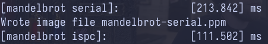

## Program 3: Parallel Fractal Generation Using ISPC (20 points) ##

Now that you're comfortable with SIMD execution, we'll return to parallel Mandelbrot fractal generation (like in program 1). Like Program 1, Program 3 computes a mandelbrot fractal image, but it achieves even greater speedups by utilizing both the CPU's four cores and the SIMD execution units within each core.

In Program 1, you parallelized image generation by creating one thread
for each processing core in the system. Then, you assigned parts of
the computation to each of these concurrently executing
threads. (Since threads were one-to-one with processing cores in
Program 1, you effectively assigned work explicitly to cores.) Instead
of specifying a specific mapping of computations to concurrently
executing threads, Program 3 uses ISPC language constructs to describe
*independent computations*. These computations may be executed in
parallel without violating program correctness (and indeed they
will!). In the case of the Mandelbrot image, computing the value of
each pixel is an independent computation. With this information, the
ISPC compiler and runtime system take on the responsibility of
generating a program that utilizes the CPU's collection of parallel
execution resources as efficiently as possible.

You will make a simple fix to Program 3 which is written in a combination of
C++ and ISPC (the error causes a performance problem, not a correctness one).
With the correct fix, you should observe performance that is over 32 times
greater than that of the original sequential Mandelbrot implementation from
`mandelbrotSerial()`.


### Program 3, Part 1. A Few ISPC Basics (10 of 20 points) ###

When reading ISPC code, you must keep in mind that although the code appears
much like C/C++ code, the ISPC execution model differs from that of standard
C/C++. In contrast to C, multiple program instances of an ISPC program are
always executed in parallel on the CPU's SIMD execution units. The number of
program instances executed simultaneously is determined by the compiler (and
chosen specifically for the underlying machine). This number of concurrent
instances is available to the ISPC programmer via the built-in variable
`programCount`. ISPC code can reference its own program instance identifier via
the built-in `programIndex`. Thus, a call from C code to an ISPC function can
be thought of as spawning a group of concurrent ISPC program instances
(referred to in the ISPC documentation as a gang). The gang of instances
runs to completion, then control returns back to the calling C code.

__Stop. This is your friendly instructor. Plase read the preceding paragraph again. Trust me.__

As an example, the following program uses a combination of regular C code and ISPC
code to add two 1024-element vectors. As we discussed in class, since each
instance in a gang is independent and performing the exact
same program logic, execution can be accelerated via
implementation using SIMD instructions.

A simple ISPC program is given below. The following C code will call the
following ISPC code:

    ------------------------------------------------------------------------
    C program code: myprogram.cpp
    ------------------------------------------------------------------------
    const int TOTAL_VALUES = 1024;
    float a[TOTAL_VALUES];
    float b[TOTAL_VALUES];
    float c[TOTAL_VALUES]
 
    // Initialize arrays a and b here.
     
    sum(TOTAL_VALUES, a, b, c);
 
    // Upon return from sum, result of a + b is stored in c.

The corresponding ISPC code:

    ------------------------------------------------------------------------
    ISPC code: myprogram.ispc
    ------------------------------------------------------------------------
    export sum(uniform int N, uniform float* a, uniform float* b, uniform float* c)
    {
      // Assumption programCount divides N evenly.
      for (int i=0; i<N; i+=programCount)
      {
        c[programIndex + i] = a[programIndex + i] + b[programIndex + i];
      }
    }

The ISPC program code above interleaves the processing of array elements among
program instances. Note the similarity to Program 1, where you statically
assigned parts of the image to threads.

However, rather than thinking about how to divide work among program instances
(that is, how work is mapped to execution units), it is often more convenient,
and more powerful, to instead focus only on the partitioning of a problem into
independent parts. ISPCs `foreach` construct provides a mechanism to express
problem decomposition. Below, the `foreach` loop in the ISPC function `sum2`
defines an iteration space where all iterations are independent and therefore
can be carried out in any order. ISPC handles the assignment of loop iterations
to concurrent program instances. The difference between `sum` and `sum2` below
is subtle, but very important. `sum` is imperative: it describes how to
map work to concurrent instances. The example below is declarative: it
specifies only the set of work to be performed.

    -------------------------------------------------------------------------
    ISPC code:
    -------------------------------------------------------------------------
    export sum2(uniform int N, uniform float* a, uniform float* b, uniform float* c)
    {
      foreach (i = 0 ... N)
      {
        c[i] = a[i] + b[i];
      }
    }

Before proceeding, you are encouraged to familiarize yourself with ISPC
language constructs by reading through the ISPC walkthrough available at
<http://ispc.github.io/example.html>. The example program in the walkthrough
is almost exactly the same as Program 3's implementation of `mandelbrot_ispc()`
in `mandelbrot.ispc`. In the assignment code, we have changed the bounds of
the foreach loop to yield a more straightforward implementation.


### Q3-1
*Compile and run the program mandelbrot ispc. __The ISPC compiler is currently
configured to emit 8-wide AVX2 vector instructions.__
What is the maximum speedup you expect given what you know about these CPUs?
Why might the number you observe be less than this ideal? (Hint:
Consider the characteristics of the computation you are performing?
Describe the parts of the image that present challenges for SIMD
execution? Comparing the performance of rendering the different views
of the Mandelbrot set may help confirm your hypothesis.).*

*We remind you that for the code described in this subsection, the ISPC
compiler maps gangs of program instances to SIMD instructions executed
on a single core. This parallelization scheme differs from that of
Program 1, where speedup was achieved by running threads on multiple
cores.*

*If you look into detailed technical material about the CPUs in the myth
machines, you will find there are a complicated set of rules about how many
scalar and vector instructions can be run per clock.
For the purposes of this assignment, you can assume that there are about
as many 8-wide vector execution units as there are scalar execution units
for floating point math.*

#### Apple M1 chip

Since the M1 chip supports 128-bit wide vector instructions. I configure
the ISPC compiler accordingly:

```make
ISPCFLAGS=-O3 --target=neon-i32x4 --arch=aarch64 --opt=disable-fma --pic
```

This ensures that ISPC generates code optimized for 4-wide 32-bit integer
operations.

The maximum expected speedup with 4-wide vector instruction is 4x compared to
SISD. However, the observed runtime speedups are 3.22x and 2.54x for View 1
and 2, respectively, as shown in the images below.

View1



View2


Similar to the observations from the program2 assignment, I believe the
less-than-expect speedup is a result of workload imbalance. Although
4 pixels are computed simultaneously per clock cycle, some pixels require
longer processing time than others. This can be observed in regions
where there is a transition between white and black pixels. Consequently,
View2 exhibits worse speedup than View1 because these transitory regions
are more prevalent in View2.

### Program 3, Part 2: ISPC Tasks (10 of 20 points) ###

ISPCs SPMD execution model and mechanisms like `foreach` facilitate the creation
of programs that utilize SIMD processing. The language also provides an additional
mechanism utilizing multiple cores in an ISPC computation. This mechanism is
launching _ISPC tasks_.

See the `launch[2]` command in the function `mandelbrot_ispc_withtasks`. This
command launches two tasks. Each task defines a computation that will be
executed by a gang of ISPC program instances. As given by the function
`mandelbrot_ispc_task`, each task computes a region of the final image. Similar
to how the `foreach` construct defines loop iterations that can be carried out
in any order (and in parallel by ISPC program instances, the tasks created by
this launch operation can be processed in any order (and in parallel on
different CPU cores).

**What you need to do:**

1.  Run `mandelbrot_ispc` with the parameter `--tasks`. What speedup do you
  observe on view 1? What is the speedup over the version of `mandelbrot_ispc` that
  does not partition that computation into tasks?
2.  There is a simple way to improve the performance of
  `mandelbrot_ispc --tasks` by changing the number of tasks the code
  creates. By only changing code in the function
  `mandelbrot_ispc_withtasks()`, you should be able to achieve
  performance that exceeds the sequential version of the code by over 32 times!
  How did you determine how many tasks to create? Why does the
  number you chose work best?
3.  _Extra Credit: (2 points)_ What are differences between the thread
  abstraction (used in Program 1) and the ISPC task abstraction? There
  are some obvious differences in semantics between the (create/join
  and (launch/sync) mechanisms, but the implications of these differences
  are more subtle. Here's a thought experiment to guide your answer: what
  happens when you launch 10,000 ISPC tasks? What happens when you launch
  10,000 threads? (For this thought experiment, please discuss in the general case
  - i.e. don't tie your discussion to this given mandelbrot program.)

_The smart-thinking student's question_: Hey wait! Why are there two different
mechanisms (`foreach` and `launch`) for expressing independent, parallelizable
work to the ISPC system? Couldn't the system just partition the many iterations
of `foreach` across all cores and also emit the appropriate SIMD code for the
cores?

_Answer_: Great question! And there are a lot of possible answers. Come to
office hours.

