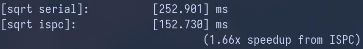

## Program 4: Iterative `sqrt` (15 points) ##

Program 4 is an ISPC program that computes the square root of 20 million
random numbers between 0 and 3. It uses a fast, iterative implementation of
square root that uses Newton's method to solve the equation ${\frac{1}{x^2}} - S = 0$.
The value 1.0 is used as the initial guess in this implementation. The graph below shows the 
number of iterations required for `sqrt` to converge to an accurate solution 
for values in the (0-3) range. (The implementation does not converge for 
inputs outside this range). Notice that the speed of convergence depends on the 
accuracy of the initial guess.

Note: This problem is a review to double-check your understanding, as it covers similar concepts as programs 2 and 3.

.")

## Hardware

- Ryzen 7950x CPU
    - 4.5GHz
    - 16 cores, 2 hyperthreads per core
    - Supports 256-bit wide AVX2 vector instructions
- Apple M1 chip:
    - 3.2GHz
    - 4 (performance) + 4 (efficiency) cores, no hyperthreading

I update the MakeFile to reconfigure ISPC compiler on Apple machine:

```make
ISPCFLAGS=-O3 --target=neon-i32x8 --arch=aarch64 --pic
```

## Note
All speedups are measured across 10 trials.

## Q4-1
*Build and run `sqrt`. Report the ISPC implementation speedup for 
single CPU core (no tasks) and when using all cores (with tasks). What 
is the speedup due to SIMD parallelization? What is the speedup due to 
multi-core parallelization?*

- Speedups from serial, SIMD, and multi-core (32 tasks) implementations
on Ryzen 7950x:

    

- Speedups from serial, SIMD, and multi-core (8 tasks) implementations
on Apple machine:

    

The observed speedup from the ISPC SIMD implementation of `sqrt` for a single
CPU core is less than the
expected 8x on both machines. Similar to the observation made in
program 3, this discrepancy is due to workload imbalance across the lanes of
vectors. The approach in which the input array is initialized likely results in
neighboring values with different distances from 1.0, i.e. the point where
Newton's method converges fastest.

```cpp
    values[i] = .001f + 2.998f * static_cast<float>(rand()) / RAND_MAX;
```

Furthermore, the speedup from ISPC SIMD multi-core implementation of `sqrt` is
also lower than the theoretical 32x on the Ryzen 7950x and 8x on the Apple machines.
However, launching tasks on different cores do yield further speedup
improvements.


## Q4-2
*Modify the contents of the array values to improve the relative speedup 
of the ISPC implementations. Construct a specifc input that
__maximizes speedup over the sequential version of the code__ and report the
resulting speedup achieved (for both the with- and without-tasks ISPC implementations). Does your modification improve SIMD speedup?
Does it improve multi-core speedup (i.e., the benefit of moving from ISPC without-tasks to ISPC with tasks)? Please explain why.*

To balance the workload across neighboring lanes in the vectors, one option
is to assign every element of the input array the same value. However, the
choice of value is crucial. 
Within the range of 0 and 3, with 1.0 being the value
where Newton's method converges the fastest, assigning 3.0 to all elements
of the array results in the heaviest computation workload, whereas setting
everything to 0 produces a slightly lower computation load. The heavier workload
(using 3.0) benefits the multi-core implementation the most, as it can better
amortize the overhead associated with creating threads.

Another approach to verify the impact of workload is to
set every element to 1.0 in the input array. Since convergence is very fast at
this value, the thread creation overhead becomes more significant, leading to
a negative impact on the overall speedup for the multi-core implementation (
see the snapshot below).

- Speedups from serial, SIMD, and multi-core (32 tasks) implementations on
Ryzen 7950x:

    

- Speedups from serial, SIMD, and multi-core (8 tasks) implementations on
Apple M1 machine:

    

- Speedups from serial, SIMD, and multi-core (8 tasks) implementations on
Apple M1 machine, with setting all elements to 1.0 in the input array:

    

__It is surprising to observe that on the Apple M1 machine__, the multi-core (8 tasks)
implementation shows no speedup improvement when all elements are set to 3.0.
In fact, the performance even degrades compared to using an input array with 
randomly initialized values.

## Q4-3
*Construct a specific input for `sqrt` that __minimizes speedup for ISPC
(without-tasks) over the sequential version of the code__. Describe this input,
describe why you chose it, and report the resulting relative performance of
the ISPC implementations. What is the reason for the loss in efficiency? 
__(keep in mind we are using the `--target=avx2` option for ISPC,
which generates 8-wide SIMD instructions)__.*

To observe the worst speedup performance with the SIMD single core
implementation, a straightforward approach is to initialize the input array
such that one lane in each vector holds a value of 3.0 (heaviest workload)
while all other lanes are set to 1.0 (lightest workload).
This initialization defeats the benefits of the
SIMD implementation entirely, as it introduces extreme workload imbalance
across the lanes.

- Speedups from serial and SIMD implementations on Ryzen 7950x:

    

- Speedups from serial and SIMD implementations on Apple M1 machine:

    


## Q4-4
Write your own version of the `sqrt` 
function manually using AVX2 intrinsics. To get credit your 
implementation should be nearly as fast (or faster) than the binary 
produced using ISPC. You may find the [Intel Intrinsics Guide](https://software.intel.com/sites/landingpage/IntrinsicsGuide/) 
very helpful.

Function `sqrtVector` in `sqrtVector.cpp` is the vectorized implementation
of `sqrt` using AVX2 intrinsics. The speedup on Ryzen 7950x (~4.9x) is
illustrated in the following image.


By default, `sqrtVector` is not enabled. Below lists steps to turn it on:
- Uncomment `line 31` in the `MakeFile` to add `sqrtVector.o` to the
    compile object list:

    ```MakeFile
    OBJS=$(OBJDIR)/main.o $(OBJDIR)/sqrtSerial.o $(OBJDIR)/sqrtVector.o $(OBJDIR)/sqrt_ispc.o $(PPM_OBJ) $(TASKSYS_OBJ)
    ```

- Uncomment `line 13` in `main.cpp` to import `sqrtVector` function:

    ```cpp
    extern void sqrtVector(int N, float startGuess, float* values, float* output);
    ```
- Uncomment `line 105-118` to call `sqrtVector` function and report speedup.

Lastly, _it is important to note_ that the current implementation does not take
care of the case where N % 8 != 0 (N is the number of elements).
