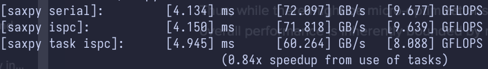
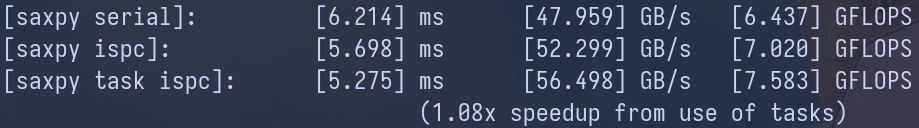

## Program 5: BLAS `saxpy` (10 points) ##

Program 5 is an implementation of the saxpy routine in the BLAS (Basic Linear
Algebra Subproblems) library that is widely used (and heavily optimized) on 
many systems. `saxpy` computes the simple operation `result = scale*X+Y`, where `X`, `Y`, 
and `result` are vectors of `N` elements (in Program 5, `N` = 20 million)
and `scale` is a scalar. Note that `saxpy` performs two math operations
(one multiply, one add) for every three elements used. `saxpy` is a
*trivially parallelizable computation* and features predictable, regular data
access and predictable execution cost.

## Q5-1
Compile and run `saxpy`. The program will report the performance of
ISPC (without tasks) and ISPC (with tasks) implementations of saxpy. What 
speedup from using ISPC with tasks do you observe? Explain the performance of
this program. Do you think it can be substantially improved?
(For example, could you rewrite the code to achieve near linear speedup?
Yes or No? Please justify your answer.)

The speedup from using ISPC with tasks are 0.84x on Apple M1 machine and x on
Ryzen 7950x, shown in the following images.

Apple M1 chip:

Ryzen 7950x:

The `saxpy` program is bounded by memory bandwidth, peforming two floating-point
operations for every 3 data accesses (2 loads and 1 write). This corresponds to an arithmetic
intensity of 2/3, meaning that the performance is memory-bound rather than
compute-bound. Even when distributing the computational workloads across multiple cores,
the overall performance remains limited by the capacity to move data in and out of
memory. Consequently, achieving a linear speedup is not feasible.

## Q5-2
Note that the total memory bandwidth consumed
computation in `main.cpp` is `TOTAL_BYTES = 4 * N * sizeof(float);`.  Even
though `saxpy` loads one element from X, one element from Y, and writes one
element to `result` the multiplier by 4 is correct.  Why is this the case?
(Hint, think about how CPU caches work.)

This is because writing (or storing) the value to the result array corresponds
to two instructions when there is a write/store cache miss. In that scenario,
the cache line containing the result element is first
loaded before the write/store operation can occur. That is why the
multiplier is 4.

However, I believe the equation calculating the `TOTAL_BYTES` provides an estimate
for the worse-case scenario. When the code accesses elements using `X[i]` and
`Y[i]`, an entire cache line containing the `ith` element is loaded from
memory, not just that single element.
Depending on the cache line size, not every load results in a cache miss.
Consequently, in practice the effective multiplier is not expected to be
4 for every elements.

## Q5-3
Improve the performance of `saxpy`. We're looking for a significant speedup
here, not just a few percentage points. If successful, describe how you
did it and what a best-possible implementation on these systems might achieve.
Also, if successful, come tell the staff, we'll be interested. ;-)

