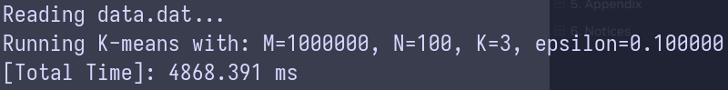

## Program 6: Making `K-Means` Faster (15 points) ##

Program 6 clusters one million data points using the K-Means data clustering
algorithm ([Wikipedia](https://en.wikipedia.org/wiki/K-means_clustering),
[CS 221 Handout](https://stanford.edu/~cpiech/cs221/handouts/kmeans.html)).
If you're unfamiliar with the algorithm, don't worry! The specifics aren't
important to the exercise, but at a high level, given K starting points
(cluster centroids), the algorithm iteratively updates the centroids until a
convergence criteria is met. The results can be seen in the below images
depicting the state of the algorithm at the beginning and end of the program,
where red stars are cluster centroids and the data point colors correspond to
cluster assignments.

In the starter code you have been given a correct implementation of the K-means
algorithm, however in its current state it is not quite as fast as we would
like it to be. This is where you come in! Your job will be to figure out
**where** the implementation needs to be improved and **how** to improve it.
The key skill you will practice in this problem is __isolating a performance
hotspot__.  We aren't going to tell you where to look in the code.  You need to
figure it out. Your first thought should be... where is the code spending the
most time and you should insert timing code into the source to make
measurements.  Based on these measurements, you should focus in on the part of
the code that is taking a significant portion of the runtime, and then
understand it more carefully to determine if there is a way to speed it up.

## Note

- __All runtime measurements reported in this document are from a single run, not
averaged over multiple runs__.

- To toggle between different implementations of computeAssignments, simply
uncomment one of the lines from `line 357-361`.

## Q6-1
Once you have the data, compile and run `kmeans` (it may take longer than usual
for the program to load the data on your first try). The program will report
the total runtime of the algorithm on the data.

Obtaining the `data.dat` by uncommenting `line 97 to 128` in `main.cpp`.

- Apple M1 machine:

- Ryzen 7950x

## Q6-2

Run `pip install -r requirements.txt` to download the necessary plotting packages.
Next, try running `python3 plot.py` which will generate the files "start.png"
and "end.png" from the logs ("start.log" and "end.log") generated from running
`kmeans`. These files will be in the current directory and should look similar
to the above images. __Warning: You might notice that not all points are
assigned to the "closest" centroid. This is okay.__ (For those that want to
understand why: We project 100-dimensional datapoints down to 2-D using
[PCA](https://en.wikipedia.org/wiki/Principal_component_analysis) to produce
these visualizations. Therefore, while the 100-D datapoint is near the
appropriate centroid in high dimensional space, the projects of the datapoint
and the centroid may not be close to each other in 2-D.). As long as the
clustering looks "reasonable" (use the images produced by the starter code in
step 2 as a reference) and most points appear to be assigned to the clostest
centroid, the code remains correct.

## Q6-3

Utilize the timing function in `common/CycleTimer.h` to determine where in
the code there are performance bottlenecks. You will need to call
`CycleTimer::currentSeconds()`, which returns the current time (in seconds) as
a floating point number. Where is most of the time being spent in the code?

Computing the assignment for each input point accounts for most of the runtime.

## Q6-4

Based on your findings from the previous step, improve the implementation.
We are looking for a speedup of about 2.1x or more
(i.e $\frac{oldRuntime}{newRuntime} >= 2.1$). Please explain how you arrived at
your solution, as well as what your final solution is and the associated speedup.
The writeup of this process should describe a sequence of steps. We expect
something of the form "I measured ... which let me to believe X. So to improve
things I tried ... resulting in a speedup/slowdown of ...".

Computing distance between input point `m` and a centroid from cluster `k` can
be done in parallel. Please check the `assignmentWorkerStart` function in
`kmeansThread.cpp`. An improvement of approximate 2x is observed on both Apple
M1 and Ryzen 7950x chips.

- Apple M1 machine:

- Ryzen 7950x

However, the aggregating step where I compare all distances is still the
bottleneck. Instead of having each thread calculate distances for all M data
points to a single cluster centroid and then consolidating, we could
reconstruct the parallelism to have each thread handle a subset of datapoint
and compute distances to all cluster centroids. With this approach, I can modify
the original `computeAssignments` function to handle a batch of data points.

Specifically, the `computeAssignmentsDataThread` function in `kmeansThread.cpp`
takes a
subset of data points and computes the distance of each point to all cluster
centroids. The `assignmentImprovedWorkerStart` function divides the M data
points into multiple batches. The number of batches is determined
based on the number of threads used (currently hard-coded to 8). This
implementation achieves a speedup of 3.93x on Apple M1 machine, and I believe
its performance could
be further improved using additional multi-core techniques.

- Apple M1 machine:

- Ryzen 7950x:

During the implementation of the `computeAssignmentsDataThread` function, I
also realized that simply swapping the inner loop (over the M dimension) with the
outer loop (over the K dimension), we can achieve two benefits:
    - Avoid allocating the `minDist` array of size M.
    - Achieve a minor speedup, since `M >> K` (approximately ~1.184x and
    ~1.196x improvement on Apple M1 machine and Ryzen 7950x chip, respectively).

Please refer to the `computeAssignmentImprovedOriginal` function in `kmeansThread.cpp`.

- Apple M1 machine:

- Ryzen 7950x:

  
## Constraints

- You may only modify code in `kmeansThread.cpp`. You are not allowed to
modify the `stoppingConditionMet` function and you cannot change the interface
to `kMeansThread`, but anything is fair game (e.g. you can add new members
to the `WorkerArgs` struct, rewrite functions, allocate new arrays, etc.).
However...
- **Make sure you do not change the functionality of the implementation!
If the algorithm doesn't converge or the result from running `python3 plot.py`
does not look like what's produced by the starter code, something is wrong!**
For example, you cannot simply remove the main "while" loop or change the
semantics of the `dist` function, since this would yield incorrect results.
- __Important:__ you may only parallelize __one__ of the following functions:
`dist`, `computeAssignments`, `computeCentroids`, `computeCost`.
For an example of how to write parallel code using `std::thread`,
see `prog1_mandelbrot_threads/mandelbrotThread.cpp`.
  
## Tips / Notes: 

- This problem should not require a significant amount of coding. Our solution
modified/added around 20-25 lines of code.
- Once you've used timers to isolate hotspots, to improve the code make sure
you understand the relative sizes of K, M, and N.
- Try to prioritize code improvements with the potential for high returns
and think about the different axes of parallelism available in the problem
and how you may take advantage of them.
- **The objective of this program is to give you more practice with learning
how to profile and debug performance oriented programs. Even if you don't hit
the performance target, if you demonstrate good/thoughtful debugging skills in
the writeup you'll still get most of the points.**

