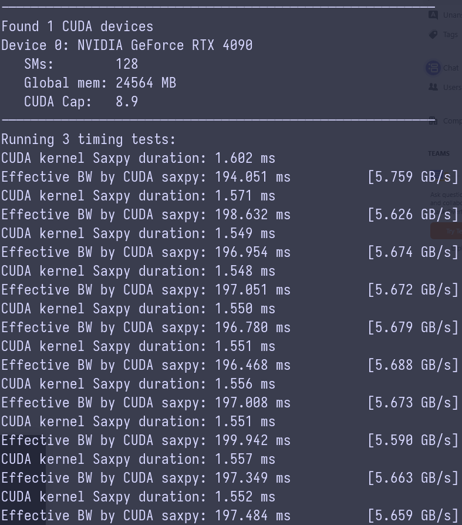

## CUDA Warm-Up 1: SAXPY

To gain a bit of practice writing CUDA programs your warm-up task is to
re-implement the SAXPY function from Assignment 1 in CUDA. Starter code for
this part of the assignment is located in the `/saxpy` directory
of the assignment repository. You can build and run the saxpy CUDA program by
calling `make` and `./cudaSaxpy` in the `/saxpy` directory.

Please finish off the implementation of SAXPY in the function `saxpyCuda`
in `saxpy.cu`. You will need to allocate device global memory arrays and copy
the contents of the host input arrays `X`, `Y`, and `result` into CUDA device
memory prior to performing the computation. After the CUDA computation is
complete, the result must be copied back into host memory. Please see the
definition of `cudaMemcpy` function in Section 3.2.2 of the Programmer's Guide
(web version), or take a look at the helpful tutorial pointed to in the
assignment starter code.

As part of your implementation, add timers around the CUDA kernel invocation
in `saxpyCuda`. After your additions, your program should time two executions:

- The provided starter code contains timers that measure **the entire
process** of copying data to the GPU, running the kernel, and copying data
back to the CPU.

- You should also insert timers the measure _only the time taken to run the
kernel_. (They should not include the time of CPU-to-GPU data transfer or
transfer of results from the GPU back to the CPU.)

**When adding your timing code in the latter case, you'll need to be careful:**
By default a CUDA kernel's execution on the GPU is _asynchronous_ with the main
application thread running on the CPU. For example, if you write code that
looks like this:

```cpp
double startTime = CycleTimer::currentSeconds();
saxpy_kernel<<<blocks, threadsPerBlock>>>(N, alpha, device_x, device_y, device_result);
double endTime = CycleTimer::currentSeconds();
```

You'll measure a kernel execution time that seems amazingly fast! (Because you
are only timing the cost of the API call itself, not the cost of actually
executing the resulting computation on the GPU.

Therefore, you will want to place a call to `cudaDeviceSynchronize()` following the
kernel call to wait for completion of all CUDA work on the GPU. This call to
`cudaDeviceSynchronize()` returns when all prior CUDA work on the GPU has
completed. Note that `cudaDeviceSynchronize()` is not necessary after the
`cudaMemcpy()` to ensure the memory transfer to the GPU is complete, since
`cudaMempy()` is synchronous under the conditions we are using it. (For those
that wish to know more, see [this documentation](https://docs.nvidia.com/cuda/cuda-runtime-api/api-sync-behavior.html#api-sync-behavior__memcpy-sync).)

```cpp
double startTime = CycleTimer::currentSeconds();
saxpy_kernel<<<blocks, threadsPerBlock>>>(N, alpha, device_x, device_y, device_result);
cudaDeviceSynchronize();
double endTime = CycleTimer::currentSeconds();
```

Note that in your measurements that include the time to transfer to and from
the CPU, a call to `cudaDeviceSynchronize()` **is not** necessary before the
final timer (after your call to `cudaMemcopy()` that returns data to the CPU)
because `cudaMemcpy()` will not return to the calling thread until after the
copy is complete.

## Q1

*What performance do you observe compared to the sequential
CPU-based implementation of SAXPY (recall your results from saxpy on Program 5
from Assignment 1)?*

Compared to the sequential CPU-based implementation (
[see Q5-1 section from assignemnt 1](../../asst1/prog5_saxpy/README.md)), the
runtime of the entire process is approximately 197 ms on average, which shows
a significant performance degradation. The main bottleneck comes from moving
data between the host and device (see below).



__Note__ that the total bytes used in the equation to compute the observed
bandwidth in the image above is `3 * N * sizeof(float)`. There are `3` arrays
copied from host to device. However, on the way out from device to host, the
total number of bytes transferred in `N * sizeof(float)` (see below where
a factor of `4` is used).

## Q2

*Compare and explain the difference between the results
provided by two sets of timers (timing only the kernel execution vs. timing the
entire process of moving data to the GPU and back in addition to the kernel
execution). Are the bandwidth values observed _roughly_ consistent with the
reported bandwidths available to the different components of the machine?
(You should use the web to track down the memory bandwidth of an NVIDIA T4 GPU.
Hint: <https://www.nvidia.com/content/dam/en-zz/Solutions/Data-Center/tesla-t4/t4-tensor-core-datasheet-951643.pdf>.
The expected bandwidth of memory bus of AWS is 5.3 GB/s, which does not match
that of a 16-lane [PCIe 3.0](https://en.wikipedia.org/wiki/PCI_Express).
Several factors prevent peak bandwidth, including CPU motherboard chipset
performance and whether or not the host CPU memory used as the source of the
transfer is “pinned” — the latter allows the GPU to directly access memory
without going through virtual memory address translation. If you are
interested, you can find more info here: <https://kth.instructure.com/courses/12406/pages/optimizing-host-device-data-communication-i-pinned-host-memory>).*

From the image above, only  0.76% of the total execution time is spent on
kernel execution.
The vast majority of the time is consumed by data transfers between the host and
device memories.

Based on my [hardware specification](../README.md), the theoretical host memory
bandwidth is 48 GB/s, while the GPU (device) memory bandwidth is
[1.01 TB/s](https://www.techpowerup.com/gpu-specs/geforce-rtx-4090.c3889).

The theoretical PCIe 4.0 (x16) transfer rate is computed as follows:

```
Effective transfer rate per lane = 16 GT/s (per lane) * (128/130) / 8 (8 bit per byte)
                                 = 1.97 GB/s
Total bandwidth = 1.97 GB/s * 16 (16 lanes)
                = 31.5 GB/s
```

This calculation shows that the PCIe 4.0 interface is the primary bottleneck
for data transfers between the host and the device.

In the observed measurements, the actual bandwidth is approximately ~ 5.6 GB/s,
which is significantly lower than the theoretical PCIe 4.0 bandwidth. In addition
to the possible reasons mentioned above, I am also investigating whether running
the program within `WSL` affects the measured bandwidth values.

I set up 2 additional timers to measure the transfer time and corresponding
bandwidth for both host-to-device and device-to-host transfers, as shown in the
image below. Although there is a significant difference in memory bandwidth
between the host and the device, the observed transfer bandwidth is expected to
be similar regardless of the transfer direction.


__Note__ that only `N * sizeof(float)` bytes are transferred from device to
host, so I compute the device-to-host bandwidth using this amount.
Additionally, I use `4 * N * sizeof(float)` bytes in the equation 
for calculating the
overall process bandwidth. This difference in transferred data size explains
why the observed bandwidth values differ between two images.


